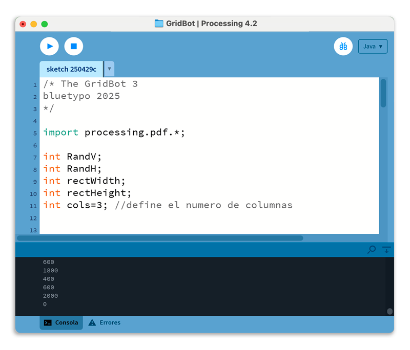

# GridBot

**GridBot** es un sencillo pero potente script desarrollado por **Manuel Guerrero** para **Processing**.  
Su objetivo principal es generar **retículas dinámicas** mediante la **descomposición geométrica** de un rectángulo.  
Esta herramienta resulta especialmente útil en proyectos de:

- **Diseño de carteles**
- **Diseño editorial**
- **Creación de interfaces gráficas**

Facilita la **organización visual** y la **disposición estructurada** de elementos, optimizando la composición gráfica en diversos contextos de diseño.

---

## Características principales

- **Generación aleatoria** de retículas a partir de divisiones geométricas.
- **Exportación automática** en formato **.pdf** para su posterior edición o impresión.
- **Interacción sencilla** mediante **clicks** del mouse.
- Código ligero, fácil de entender y personalizar.

---

## Uso

1. Abre el archivo `GridBot.pde` en el entorno de **Processing**.
2. Ejecuta el sketch (`▶️ Run`).
3. Haz **click** en cualquier parte del lienzo para:
   - Generar una **nueva retícula** aleatoria.
   - **Exportar** automáticamente un archivo **.pdf** en la carpeta del proyecto (`/data/` o raíz del sketch, dependiendo de la configuración).

---

## Requisitos

- **Processing** (versión 3.0 o superior recomendada).
- Librerías estándar de Processing (no requiere instalaciones adicionales).

---

## Muestra

A continuación, una muestra de retículas generadas por GridBot:



---

## Instalación

Si deseas usar GridBot en tu propio proyecto:

```bash
1. Clona o descarga este repositorio.
2. Abre el archivo GridBot.pde en Processing.
3. Ejecuta y comienza a generar retículas.
```

---

## Licencia

Este proyecto está publicado bajo la licencia [CC0 1.0 Universal (CC0-1.0) Public Domain Dedication](LICENSE).  
Esto significa que puedes copiar, modificar, distribuir y ejecutar el proyecto, incluso para fines comerciales, sin necesidad de pedir permiso.

---

## Créditos

Desarrollado por [**Manuel Guerrero**](https://github.com/bluetypo)  
Para cualquier comentario, sugerencia o mejora, se aceptan *pull requests* y *issues*.

---

## ¿Cómo contribuir?

Si deseas colaborar:

1. Haz un **fork** de este repositorio.
2. Crea una nueva rama (`git checkout -b feature/nueva-funcionalidad`).
3. Realiza tus cambios y haz un commit (`git commit -m 'Añadir nueva funcionalidad'`).
4. Haz push a tu rama (`git push origin feature/nueva-funcionalidad`).
5. Abre un **pull request** para revisión.
