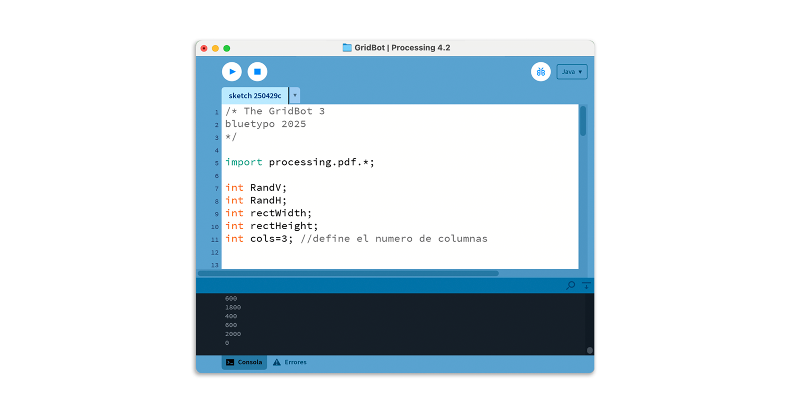
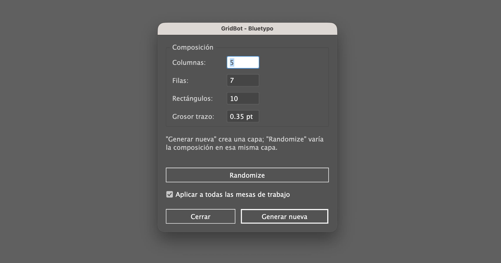

# GridBot

**GridBot** es un sencillo script desarrollado por **Manuel Guerrero** inicialmente creado para **Processing**.  
Su objetivo principal es generar **retículas dinámicas** mediante la **descomposición geométrica** de un rectángulo.  
Esta herramienta resulta especialmente útil en proyectos de:

- **Diseño de carteles**
- **Diseño editorial**
- **Creación de interfaces gráficas**

Facilita la **organización visual** y la **disposición estructurada** de elementos, optimizando la composición gráfica en diversos contextos de diseño.

Este script surge como material y recurso didáctico del curso de Domestika:  
- [**Diseño de carteles tipográficos experimentales**](https://www.domestika.org/es/courses/464-diseno-de-carteles-tipograficos-experimentales)

[](https://www.domestika.org/es/courses/464-diseno-de-carteles-tipograficos-experimentales)

---

## Características principales

- **Generación aleatoria** de retículas a partir de divisiones geométricas.
- **Exportación automática** en formato **.pdf** para su posterior edición o impresión.
- **Plantillas PDF listas para usar** con diversas configuraciones de columnas y filas (formato A5).
- **Interacción sencilla** mediante clicks del mouse.
- Código ligero, fácil de entender y personalizar.

---

## Estructura del repositorio

```text
GridBot/
├── processing/
│   └── GridBot/
│       └── GridBot.pde         # Versión para Processing
├── illustrator/
│   ├── GridBot_v0.2.1.jsx      # Script para Adobe Illustrator (ExtendScript)
│   └── install.md              # Guía de instalación para Illustrator
├── affinity/
│   ├── GridBot.js              # Script para Canva Affinity 3.3+ (JavaScript)
│   └── install.md              # Guía de instalación y uso en Affinity
├── pdf/
│   ├── 3x5col_A5.pdf           # Plantilla A5 · 3 cols × 5 filas
│   ├── 5x7col_A5.pdf           # Plantilla A5 · 5 cols × 7 filas
│   └── 6x9col_A5.pdf           # Plantilla A5 · 6 cols × 9 filas
├── assets/                     # Muestras
├── README.md                   # Documentación
└── LICENSE                     # Licencia CC0 1.0
```

---

## Uso

### Opción 1: Processing
1. Abre el archivo `processing/GridBot/GridBot.pde` en **Processing**.
2. Ejecuta el sketch.
3. Haz **click** en el lienzo para generar una nueva retícula y exportar el `.pdf`.



### Opción 2: Adobe Illustrator
1. Abre tu documento en **Adobe Illustrator**.
2. Ve al menú **Archivo > Secuencias de comandos > Otra secuencia de comandos...** (`Cmd + F12` en macOS / `Ctrl + F12` en Windows) y selecciona `illustrator/GridBot_v0.2.1.jsx`.
3. *(Opcional)* Para integrarlo en el menú de Illustrator de forma permanente, consulta la [Guía de Instalación para macOS y Windows](illustrator/install.md).



### Opción 3: Canva Affinity (v3.3+)
1. Inicia sesión con tu cuenta de Affinity / Canva *(el Script Editor no está disponible sin sesión activa)*.
2. Abre tu documento en **Affinity Designer**, **Photo** o **Publisher**.
3. Ve a `Window > Scripting > Script Editor`, pega el contenido de `affinity/GridBot.js` y presiona **Run** (`Cmd + Enter` / `Ctrl + Enter`).
4. *(Opcional)* Para configurar permisos del script (red, archivos, etc.) ve a `Settings > Scripting`. GridBot no requiere permisos especiales.
5. Para más detalles consulta la [Guía de Instalación para Canva Affinity](affinity/install.md).

---

## Plantillas PDF

La carpeta `pdf/` incluye plantillas listas para imprimir o editar, generadas con distintas configuraciones de retícula en **formato A5**:

| Archivo | Columnas | Filas | Formato |
|---|---|---|---|
| `3x5col_A5.pdf` | 3 | 5 | A5 (148 × 210 mm) |
| `5x7col_A5.pdf` | 5 | 7 | A5 (148 × 210 mm) |
| `6x9col_A5.pdf` | 6 | 9 | A5 (148 × 210 mm) |

Puedes usarlas directamente como base de trabajo o como referencia visual antes de ejecutar el script con tu propia configuración.

---

## Requisitos

- **Processing**: Versión 3.0 o superior (para el sketch `.pde`).
- **Adobe Illustrator**: Compatible con cualquier versión con soporte ExtendScript/JSX.
- **Canva Affinity**: Versión 3.2 / 3.3 o superior (sesión iniciada y opción "Enable Affinity Scripting" activada en *Settings > Scripting*).

---

## Licencia

Este proyecto está publicado bajo la licencia [CC0 1.0 Universal (CC0-1.0) Public Domain Dedication](LICENSE).  
Esto significa que puedes copiar, modificar, distribuir y ejecutar el proyecto, incluso para fines comerciales, sin necesidad de pedir permiso.

---

## Créditos

Desarrollado por [**Manuel Guerrero**](https://github.com/bluetypo)  
Para cualquier comentario, sugerencia o mejora, se aceptan *pull requests* y *issues*.

---

## ¿Cómo contribuir?

Si deseas colaborar:

1. Haz un **fork** de este repositorio.
2. Crea una nueva rama (`git checkout -b feature/nueva-funcionalidad`).
3. Realiza tus cambios y haz un commit (`git commit -m 'Añadir nueva funcionalidad'`).
4. Haz push a tu rama (`git push origin feature/nueva-funcionalidad`).
5. Abre un **pull request** para revisión.
